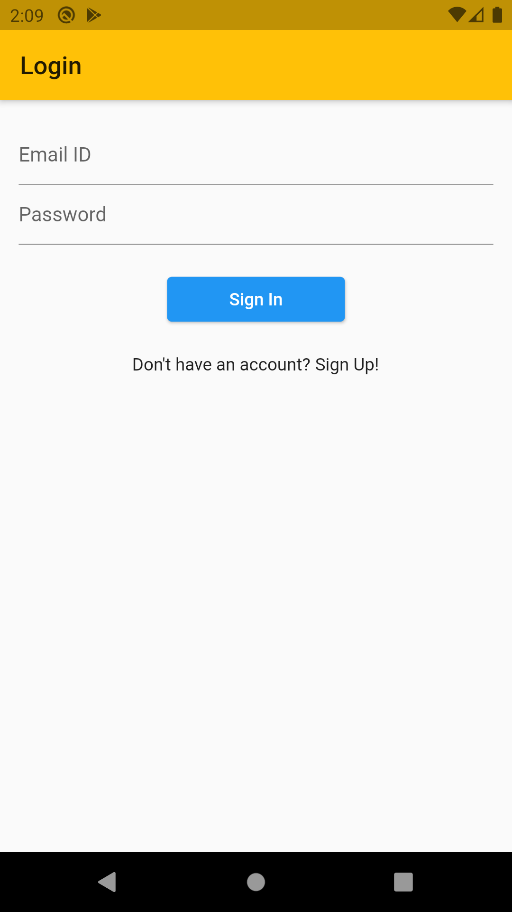
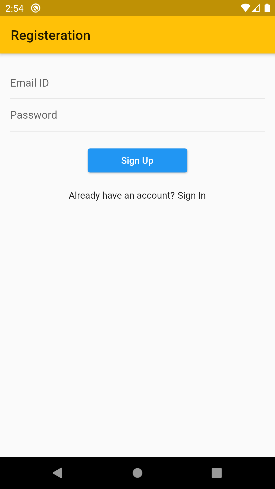
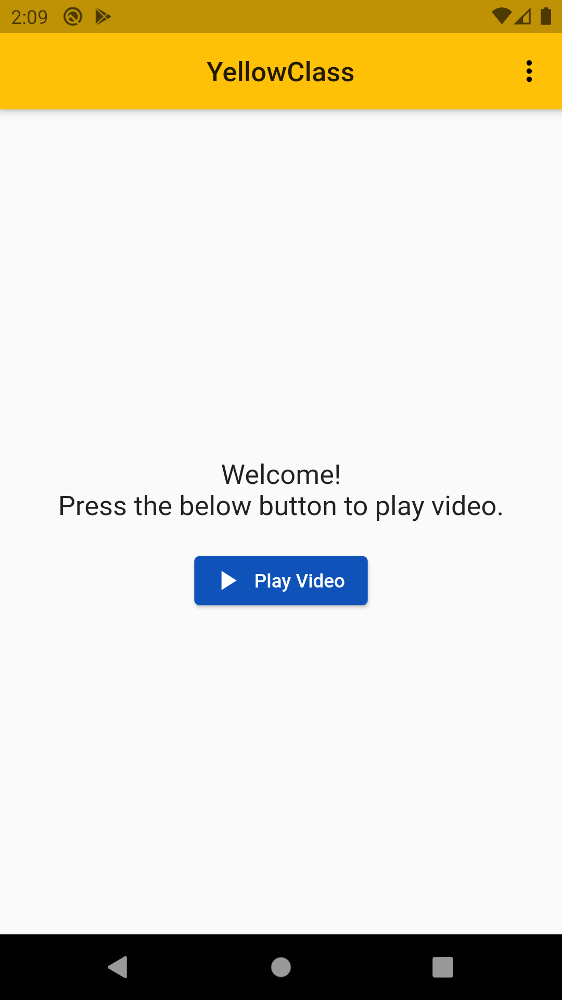

# Video Player App with Firebase Authentication

A Flutter application to demonstrate Firebase Authentication and Video Player implementation.

## Screenshots

### Firebase Authentication

<table>
  <tr>
    <td>Login Screen</td>
     <td>Signup Screen</td>
    <td>Home Screen</td>
  </tr>
  <tr>
    <td></td>
    <td></td>
    <td></td>
   
  </tr>
 </table>
 
 ### Video Player with Volume Control and Camera Feed
 
 <table>
  <tr>
    <td>Video Player</td>
     <td>Video Player</td>
  </tr>
  <tr>
    <td></td>
    <td></td>
  </tr>
 </table>

**Packages Used**

- `bloc` and `flutter_bloc` for state management.
- `firebase_core` and `firebase_auth` for Firebase initialization and authentication.
- `camera` to access front camera.
- `video_player` for video player implementation.
